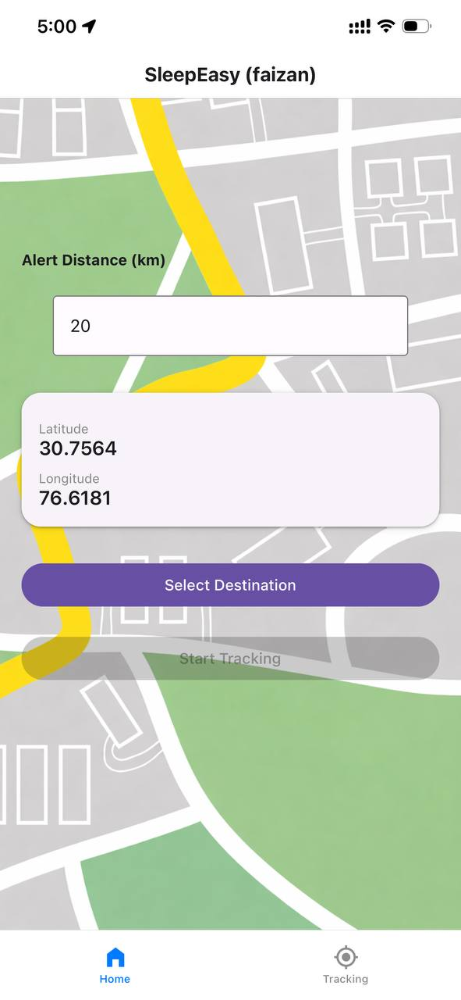
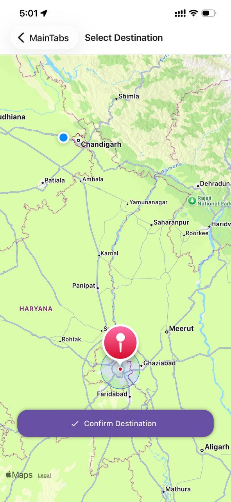
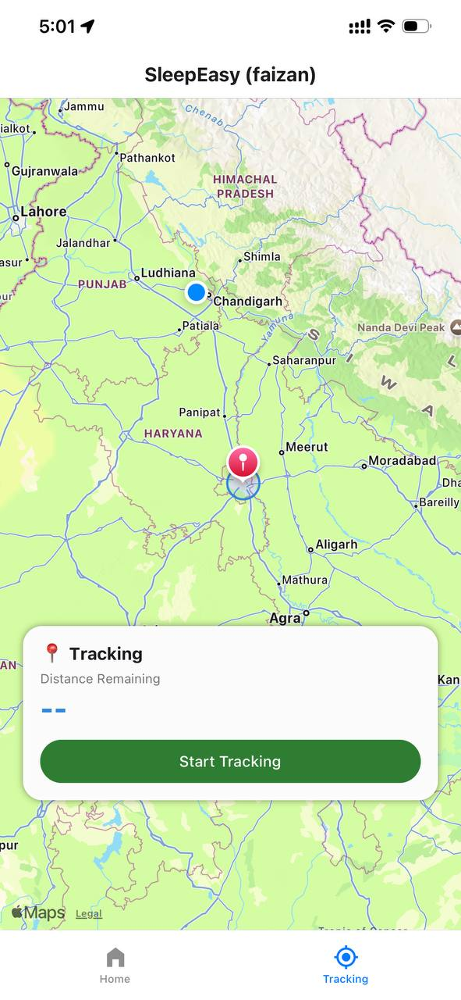
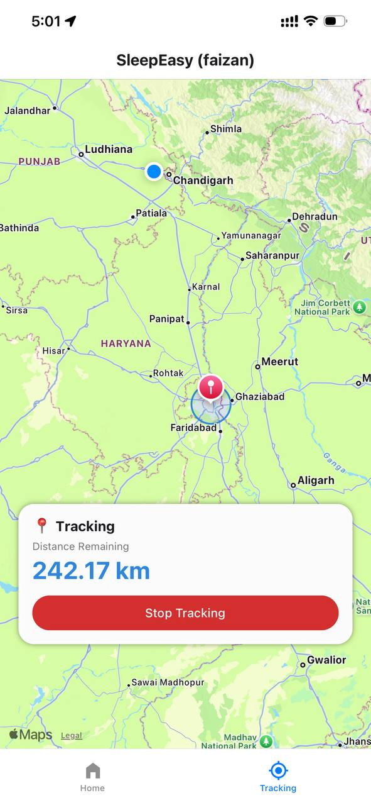
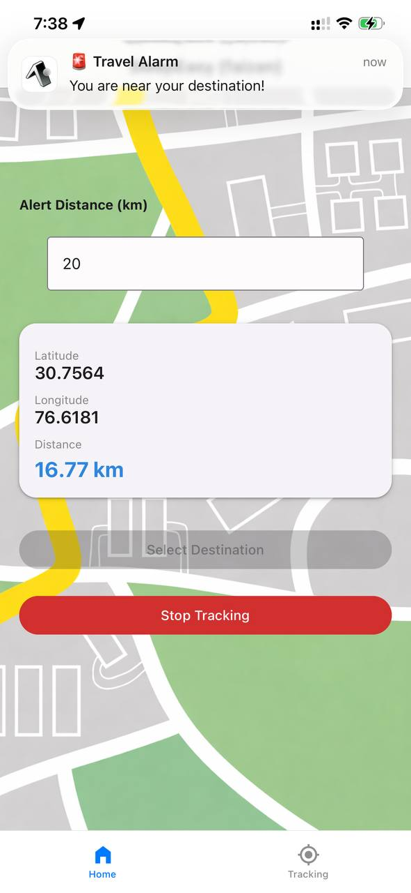

# 📍 Travel Alarm

### Never miss your stop again.

A smart GPS-based travel alarm app that wakes you up automatically when you reach your destination.

Built with **React Native + Expo**.

---

## 🚀 Demo

### 📲 Download APK

👉 [Install Latest APK](https://github.com/git-faizan-cse/travel-alarm-app/releases/tag/v1.0.0)

---

## 📸 Screenshots

<p align="center">
  
  
  
  
  
</p>

---

## ✨ Features

✅ Select destination on map  
✅ Set custom alert radius (0.5km, 1km, etc)  
✅ Live GPS tracking  
✅ Background tracking  
✅ Alarm sound + vibration  
✅ Lock screen notification with **Stop Alarm** button  
✅ Works even when phone screen is off  
✅ Lightweight battery usage  
✅ Offline compatible

---

## 🧠 Problem Solved

When traveling by bus or train, it’s easy to miss your stop if you fall asleep.

Most apps:

❌ Don’t work offline  
❌ Drain battery  
❌ Don’t ring in background  
❌ No proper alarm system

**Travel Alarm solves this with intelligent GPS tracking + edge-trigger alerts.**

---

## 🏗️ Architecture

### 📱 UI Layer (Screens)

Responsible only for user interaction

- Home Screen
- Map Screen
- Tracking Screen

↓

### ⚙️ Service Layer (Core Logic)

#### TrackingService (Brain)

- GPS tracking
- Distance calculation
- Destination detection
- Background updates

#### AlarmService

- Play sound
- Trigger vibration
- Show notifications
- Stop/Control alarm

↓

### 📦 Device/OS Layer

- Location API
- Audio Manager
- Vibration Motor
- Notification System

Clean separation:
👉 UI ≠ Logic

                ┌────────────────────┐
                │      UI Layer      │
                │ Home • Map • Track │
                └─────────┬──────────┘
                          ↓
         ┌────────────────────────────────┐
         │        Service Layer           │
         │  TrackingService | AlarmService│
         └─────────┬──────────────────────┘
                   ↓
        ┌───────────────────────────────┐
        │ Device / OS APIs              │
        │ GPS • Audio • Vibration • Noti│
        └───────────────────────────────┘

### 💡 Design Approach

The app follows a service-based architecture.

- UI layer handles only presentation
- TrackingService manages location & distance logic
- AlarmService handles alerts
- Background execution ensures alarms work even when the app is closed

This separation improves:

- maintainability
- scalability
- testability
- battery efficiency

---

## 🛠 Tech Stack

- ⚛️ React Native (Expo)
- 📍 expo-location
- 🔔 expo-notifications
- 🔊 expo-av
- 🗺 react-native-maps
- 💾 AsyncStorage
- 🔨 EAS Build

---

## ⚙️ Installation (Development)

### 1️⃣ Clone repo

```bash
git clone https://github.com/YOUR_USERNAME/travel-alarm.git
```

```bash
cd travel-alarm
```

2️⃣ Install deps

```bash
npm install
```

3️⃣ Start

```bash
npx expo start
```

📦 Build APK

```bash
eas build -p android --profile preview
```

APK will be generated on Expo dashboard.

## 🔐 Permissions Used

| Permission             | Why it’s Needed                                                    |
| ---------------------- | ------------------------------------------------------------------ |
| 📍 Location            | Track user's real-time position to monitor travel progress         |
| 🌙 Background Location | Trigger alarm even when the app is closed or running in background |
| 🔔 Notifications       | Allow stopping or managing the alarm directly from lock screen     |
| 🔊 Audio               | Play loud alarm sound when destination is reached                  |
| 📳 Vibration           | Wake the user with vibration along with sound                      |

## 📈 Future Improvements

iOS release

Custom alarm tones

Multiple saved destinations

ETA prediction

Smart battery optimization

Google Maps routing

WearOS integration

---

## 👨‍💻 Author

Faizan Hameed
CSE Student

[GitHub](https://github.com/git-faizan-cse)

[LinkedIn](https://www.linkedin.com/in/faizan-cse/)

Open to internships & opportunities 🚀

## ❤️ Story Behind This App

During winter travels between college and home,
I often took long bus journeys.

I was always scared of missing my stop while sleeping.

I searched for apps — none worked properly.

So I built my own.

From knowing nothing about mobile development
to building a full production-ready tracking + alarm system.

This project represents my journey into full-stack development.

---

## ⭐ If you like this project

Give it a ⭐ on GitHub
It motivates me to build more cool stuff 🙂

---
